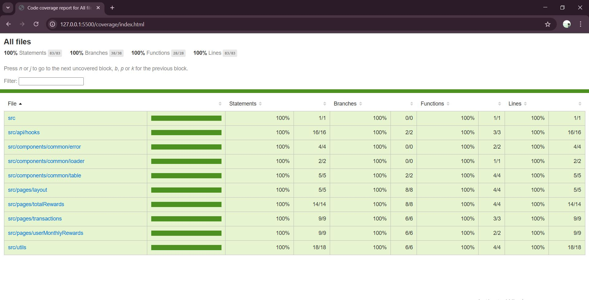

# Rewards Dashboard App

A **React + Vite** web application to display customer reward points, monthly rewards, total rewards, and transaction history.  
This project demonstrates **React functional components**, **custom hooks**, **React Router**, and **unit testing with Vitest**.

---

## **Features**

- **User Monthly Rewards:** Displays rewards earned by each customer, grouped month-wise.
- **Total Rewards:** Displays total reward points per customer.
- **Transactions:** Shows all transactions with reward points calculation.
- **404 Page:** Friendly page when route not found.
- **Custom Hooks:** `useFetchData` for API calls with loading and error handling.
- **Utility Functions:** `calculateRewardPoints`, `calculateMonthwiseRewards`.
- **Unit Testing:** Full coverage for components, hooks, and utilities using **Vitest** and **React Testing Library**.

---

## **Tech Stack**

- React 19 + Vite
- React Router DOM v7
- JavaScript (ES6+)
- Vitest + Testing Library (unit tests)
- CSS Modules / Plain CSS

---

Running the App

# start development server
npm run dev
# or
yarn dev

Running Unit Tests

# run all Vitest tests
npm run test
# or
yarn test

# generate coverage report
npm run coverage

Demo

https://github.com/user-attachments/assets/1d888235-3267-4d2a-b3fa-b54b9bf03de6

Unittest Coverage Report

